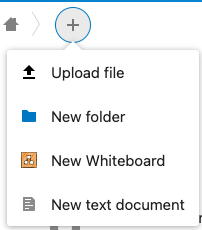
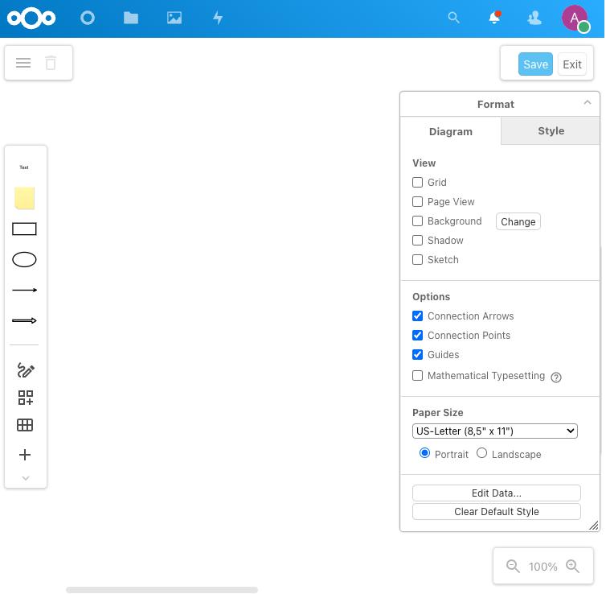

#  Nextcloud draw.io Whiteboard app

This app allows users to create and edit Whiteboard diagrams in [Nextcloud](https://nextcloud.com) using [draw.io](https://app.diagrams.net) editor.

App Store link: https://apps.nextcloud.com/apps/drawiowhiteboard

Once installed, you will see an option to create a Whiteboard diagram from the 'create file' menu.  Note: this app does not produce an app icon.

## Info ##
- Based on Draw.io integration by [Pawel Rojek](https://github.com/pawelrojek/nextcloud-drawio) 
- Requires [Nextcloud](https://nextcloud.com) >11.0.0
- Multi language support (l10n)
- Tested with Chrome 58-96 and Firefox 53-89
- Tested with PHP 5.6/7.1/7.3/8.0/8.1
- draw.io Whiteboard v1.0.0 tested with NextCloud 11.0.3 / 12.0.2 / 13.0.6 / 14.0.4 / 15.0.0 / 16.0.0 / 17.0.0 / 18.0.0 / 19.0.0 / 20.0.0 / 21.0.0 / 22.0.0 / 23.0.0 / 24.0.1
  

## Mimetype detection ##

To make draw.io Whiteboard work properly, you need to add a new mimetypes in the `mimetypemapping.json` file (at Nextcloud level).

Go to `Admin settings > Additional settings` ( `/index.php/settings/admin/additional` ) and click the `Save` button to register MIME types.

Or you can do it manually:
- Download [mimetypemapping.json](https://github.com/jgraph/nextcloud-whiteboard/raw/master/mimetypemapping.json) and save it in `config` folder
or 
- Copy `/resources/config/mimetypemapping.dist.json` to `/config/mimetypemapping.json` 
(in the `config/` folder at Nextcloud’s root directory; the file should be stored next to the `config.php` file). 
Afterwards add the two following line just after the “_comment” lines.
    "drawiowhiteboard": ["application/vnd.jgraph.mxfile"],

If all other mimetypes are not working properly, just run the
following command:

    sudo -u www-data php occ files:scan --all

## Installation ##
1. Copy Nextcloud draw.io Whiteboard app ("drawiowhiteboard" directory) to your Nextcloud server into the /apps/ directory
2. Go to "Apps" > "+ Apps" > "Not Enabled" and _Enable_ the **draw.io Whiteboard** application
3. Go to "Admin settings > Additional settings" ( /index.php/settings/admin/additional ) and click the "Save" button to register MIME types.

## Known Issues ##
- If you're experiencing problems while updating your Nextcloud intance, try to disable/delete draw.io Whiteboard app (/apps/drawiowhiteboard/) and then install/copy it again after the NC update is completed.

## Configuration ##
Go to Admin page and change the settings you want (Settings > Additional settings > draw.io Whiteboard). Click "Save" when you're done.

If you would like to self-host draw.io, you might want to consider https://github.com/jgraph/docker-drawio.

## License ##
Released under the Affero General Public License version 3 or later.

## Support ##
Any feedback and code is greatly appreciated!